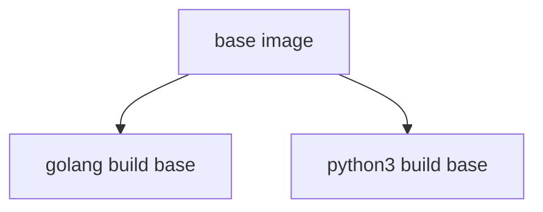

# `base-images`

## Description

This is a repository that handles building and managing of base images used across the CTDS.
It consists of Dockerfiles for each base image and workflow to build it.
More on this in the next sections.

## Dockerfiles

### Diagram



### Amazonlinux base image [`./amazonlinux-base`](./amazonlinux-base/)

Common base image for everything else.
Based on 2023 release of Amazonlinux.

### Golang build base image [`./golang-build-base`](./golang-build-base/)

Build base image used to build Go code.

### Python build base image [`./python-build-base`](./python-build-base/)

Build base image used to install dependencies and manage virtualenv for Python code.

## Workflows

Each Dockerfile and folder has it's own single workflow, which will run only for the changes in this specific Dockerfile on push, on schedule and on demand using `workflow_dispatch`.

## Adding new Docker images

1. Make sure the ECR repository is created.
2. Copy and edit template workflow. *Be consistent with the naming.*

```dockerfile
ARG AZLINUX_BASE_VERSION=master

FROM 707767160287.dkr.ecr.us-east-1.amazonaws.com/gen3/amazonlinux-base:${AZLINUX_BASE_VERSION}

LABEL name="<new-image>"

# install <dependencies>
RUN dnf update \
        --assumeyes \
    && dnf install \
        --assumeyes \
        --setopt=install_weak_deps=False \
        --setopt=tsflags=nodocs \
        <dependencies> \
    && dnf clean all \
    && rm -rf /var/cache/yum
```

3. Copy and edit workflow file.

```yaml
name: <new-image> Image Build on Push

on:
  workflow_dispatch:
    inputs:
      tag:
        description: "The tag to apply to this build. Defaults to 'latest'."
        default: "latest"
        required: false
  push:
    paths:
      - <new-image>/**
  schedule:
    - cron: '0 0 * * 0' # Weekly on Sunday at 00:00

jobs:
  GolangBuildBase:
    name: Build Go build base image
    uses: uc-cdis/.github/.github/workflows/image_build_push.yaml@master
    with:
      DOCKERFILE_LOCATION: "./<new-image>/Dockerfile"
      OVERRIDE_REPO_NAME: "<new-image>"
      OVERRIDE_TAG_NAME: "$(echo ${{ github.event_name == 'workflow_dispatch' && github.event.inputs.tag || format('{0}', github.head_ref || github.ref_name) }} | tr / _)"
    secrets: inherit

```

4. Commit and push.
