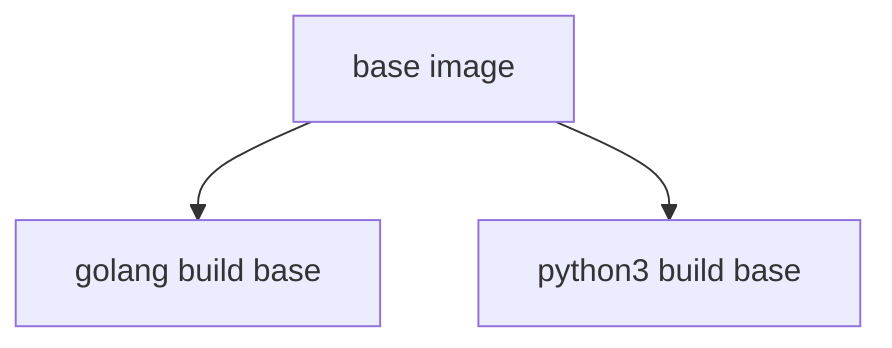

# base-images

This repo contains the base container images which are used across our code base and ensures they are rebuilt / patched weekly.  All base images must be maintained in this repo and in the approved amazonlinux, ubuntu, or debian repos using tags to appropriately label your images. 

# base-image-build.yaml 
The base-image-build.yaml runs each Saturday, it's purpose it to pull in the latest base container, patch it, install some very minimal libraries necessary, and publish to quay and ECR.  This workflow is reserved for the "underpinning" container that all other base images call on to build.
     This is reserved for these low level images

As you build base images you must make sure that you call the image built in base-image-build.yaml to ensure the latest patches and updates are applied to the image.
You must also override the label that will be applied - All base images based on AmazonLinux should end up in the repo as Quay: amazonlinux:Imagename  ie - amazonlinux:python3.9  

# Weekly_Image_Build.yaml
The Weekly_Image_Build.yaml runs each Sunday, pulling in the latest image from the step above and building ontop of that.  

# base-image-build-on-push.yaml 
This is meant for development purposes, you can add your image to this so it will build a dev image before commiting to the Master branch.  After you have completed your work we suggest removing it as we do not need every image to rebuild on every PR.  Please save us some money :) 

# Retention of Images
  ** Retention of images built are limited to 30 days **
  Since all base images are to be rebuilt on a weekly basis to ensure our compliance automation will automatically remove images older than 30 days.  

# New section (under construction :construction:)

---

# `base-images`

## Description

This is a repository that handles building and managing of base images used across the CTDS.
It consists of Dockerfiles for each base image and workflow to build it.
More on this in the next sections.

## Dockerfiles

## Diagram



### Amazonlinux base image [`./amazonlinux-base`](./amazonlinux-base/)

Common base image for everything else.
Based on 2023 release of Amazonlinux.

### Golang build base image [`./golang-build-base`](./golang-build-base/)

Build base image used to build Go code.

### Python build base image [`./python-build-base`](./python-build-base/)

Build base image used to install dependencies and manage virtualenv for Python code.

## Workflows

Each Dockerfile and folder has it's own single workflow, which will run only for the changes in this specific Dockerfile on push, on schedule and on demand using `workflow_dispatch`.

## Adding new Docker images

1. Make sure the ECR repository is created.
2. Copy and edit template workflow. *Be consistent with the naming.*

```
ARG AZLINUX_BASE_VERSION=master

FROM 707767160287.dkr.ecr.us-east-1.amazonaws.com/gen3/amazonlinux-base:${AZLINUX_BASE_VERSION}

LABEL name="<new-image>"

# install <dependencies>
RUN dnf update \
        --assumeyes \
    && dnf install \
        --assumeyes \
        --setopt=install_weak_deps=False \
        --setopt=tsflags=nodocs \
        <dependencies> \
    && dnf clean all \
    && rm -rf /var/cache/yum
```

3. Copy and edit workflow file.

```
name: <new-image> Image Build on Push

on:
  workflow_dispatch:
    inputs:
      tag:
        description: "The tag to apply to this build. Defaults to 'latest'."
        default: "latest"
        required: false
  push:
    paths:
      - <new-image>/**
  schedule:
    - cron: '0 0 * * 6' # Weekly on Sunday at 00:00

jobs:
  GolangBuildBase:
    name: Build Go build base image
    uses: uc-cdis/.github/.github/workflows/image_build_push.yaml@master
    with:
      DOCKERFILE_LOCATION: "./<new-image>/Dockerfile"
      OVERRIDE_REPO_NAME: "<new-image>"
      OVERRIDE_TAG_NAME: "$(echo ${{ github.event_name == 'workflow_dispatch' && github.event.inputs.tag || format('{0}', github.head_ref || github.ref_name) }} | tr / _)"
    secrets: inherit

```

4. Commit and push.
