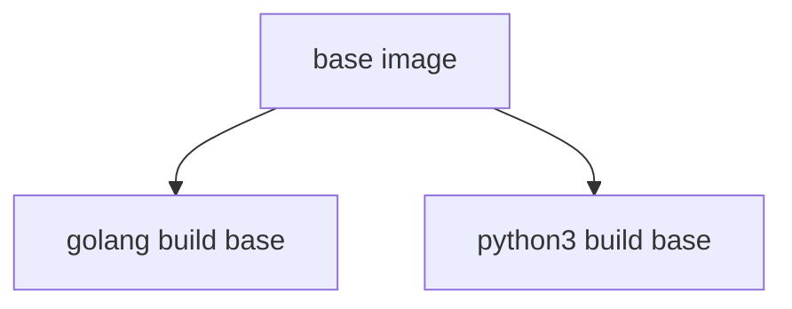

# base-images

This repo contains the base container images which are used across our code base and ensures they are rebuilt / patched weekly.  All base images must be maintained in this repo and in the approved amazonlinux, ubuntu, or debian repos using tags to appropriately label your images. 

# base-image-build.yaml 
The base-image-build.yaml runs each Saturday, it's purpose it to pull in the latest base container, patch it, install some very minimal libraries necessary, and publish to quay and ECR.  This workflow is reserved for the "underpinning" container that all other base images call on to build.
     This is reserved for these low level images

As you build base images you must make sure that you call the image built in base-image-build.yaml to ensure the latest patches and updates are applied to the image.
You must also override the label that will be applied - All base images based on AmazonLinux should end up in the repo as Quay: amazonlinux:Imagename  ie - amazonlinux:python3.9  

# Weekly_Image_Build.yaml
The Weekly_Image_Build.yaml runs each Sunday, pulling in the latest image from the step above and building ontop of that.  

# base-image-build-on-push.yaml 
This is meant for development purposes, you can add your image to this so it will build a dev image before commiting to the Master branch.  After you have completed your work we suggest removing it as we do not need every image to rebuild on every PR.  Please save us some money :) 

# Retention of Images
  ** Retention of images built are limited to 30 days **
  Since all base images are to be rebuilt on a weekly basis to ensure our compliance automation will automatically remove images older than 30 days.  

# New section (under construction :construction:)

Three base images:

